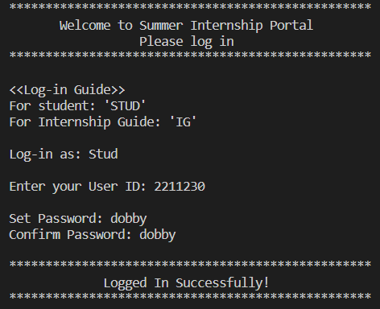
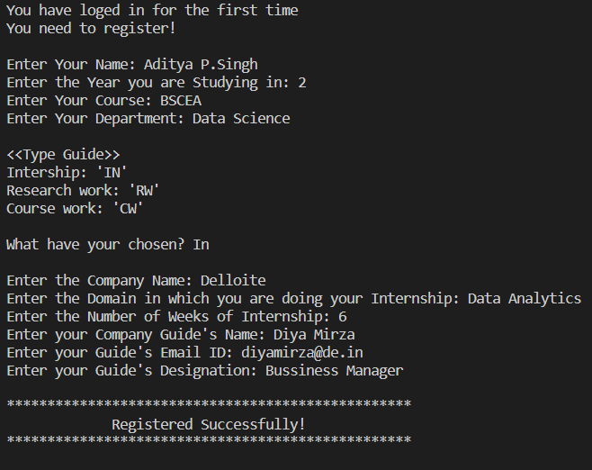
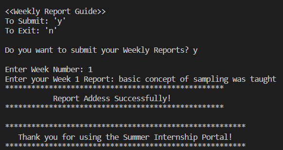
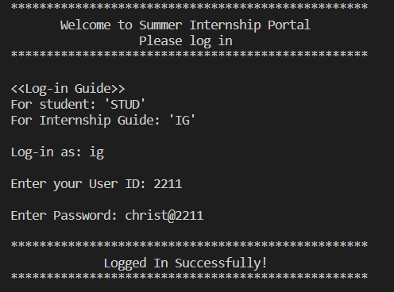
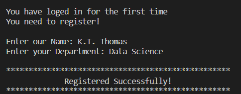
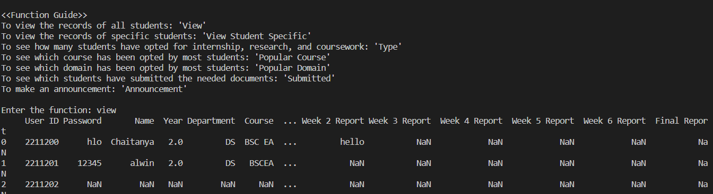

# Data-Analytics--Mini-Project

## Summer Internship Portal

### Collaborators
* [Chaitanya Birla](https://github.com/chaitanyabirla)  (Reg No 22112312)
  
* [Kanishk Saleria](https://github.com/kanishksaleria)  (Reg No 22112317)

### Description
This mini project has been developed by us as part of the course 'Data Analytics with Mini Project' in our 3rd Semester of BSc Economics and Analytics at Christ (Deemed to be University).

This project is a **Summer Internship Portal** to manage the internship for the students at Christ. The portal allows students to log in and enter their personal and academic details. It also enables the guides to monitor and manage the students’ data.  

This portal has been made Menu-based using Python, File Handling to store and access data stored in a csv file and Pandas for data manipulation. It also uses user-defined functions to perform various tasks, such as validating the user input and displaying the menu options. It is designed to be user-friendly, interactive, and secure.

### Functionality
This portal provides you two login options: **Student** and **Internship Guide**

#### Student
* The students will be first asked to `login` with their User IDs and passwords. If they are logging in for the first time, they will be asked to set a password.
* For their first login, they guided to the `registration` menu where they will have to fill in their details, including their year of study, department and course. Then they will be guided to the `type` menu where they will have to select if they have opted for an internship, research work or course work and fill in the details accordingly.
* They will get the option to enter their weekly reports and if done with all 6 weekly reports, they can enter their final report.
* If an Internship Guide has made an announcement, students will be able to see once they login.

#### Internship Guide
* The internship guides will be first asked to `login` with their User IDs and passwords. For them the passwords have been set beforehand for security.
* For their first login, they guided to the `registration` menu where they will have to fill in their details: Name and Department.
* They will be guided to `functions` menu where they can use pre-defined functions to view and manage the students' data.
* They can also make announcements which will be visible to the students.

### Packages Developed
* There have been seperate packages created for the different menus for ease. They are:
  * [login.py](https://github.com/kanishksaleria/Data-Analytics--Mini-Project/blob/main/login.py)

    This module contains the functions for student and guide login.
  * [registration.py](https://github.com/kanishksaleria/Data-Analytics--Mini-Project/blob/main/registration.py)
  
    This module contains the functions for student and guide registration, also for internship, reserchwork and coursework.
  * [guide.py](https://github.com/kanishksaleria/Data-Analytics--Mini-Project/blob/main/guide.py)

    This module contains the functions for guide operations.
  * [report.py](https://github.com/kanishksaleria/Data-Analytics--Mini-Project/blob/main/report.py)

    This module contains the functions for student report submission. 
* [Main Body.py](https://github.com/kanishksaleria/Data-Analytics--Mini-Project/blob/main/Main%20Body.py)

  The main code has been saved in this file.
* [Data](https://github.com/kanishksaleria/Data-Analytics--Mini-Project/tree/main/Data)

  The datasets have been stored under this folder in csv files.
  * [Data/Student_data.csv](https://github.com/kanishksaleria/Data-Analytics--Mini-Project/blob/main/Data/Student_data.csv)

    This file contains the data of the students.
  * [Data/Guide_data.csv](https://github.com/kanishksaleria/Data-Analytics--Mini-Project/blob/main/Data/Guide_data.csv)
  
    This file contains the data of the guides.
  * The rest of the csv files will be created as you run the code.
  
### Pre-requisites 
To run this program, you need to have Python and the following libraries installed on your system:
* *pandas*: This library provides high-performance data structures and tools for data analysis.
* *pathlib*: This library provides an object-oriented interface for working with file paths.
* *csv*: This module implements classes to read and write tabular data in CSV format.

### Sample Output
#### Output for Student 
* Login function
  

* Registration function
  

* Report function
  

#### Output for Internship Guide
* Login function
  

* Registration function
  

* Guide's function
  

